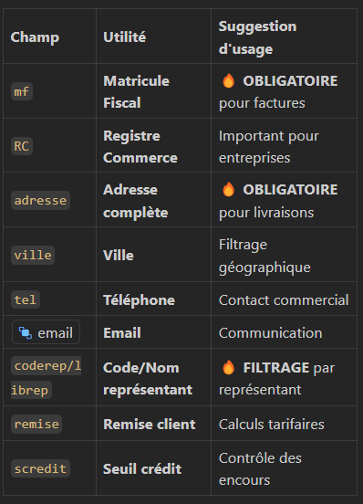
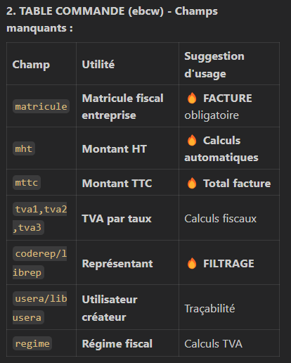

-chaque représentant voir que ses client.

-afficher les champs suivants dans les pages (articles,commandes,reglements):
lib rep (representant)
code rep (representant)
ajouter le btn 'voir' (plus de detail sur le client)

-pour la page Commandes :ajouter une Ticket de caisse (impression)
et on utilise les champs:
-matricule fiscale , matricule adr
-qte ,article ,prix unitaire, prix totale

---

# objectif : benifier de tous les champs dans la base(admin_app.sql) (si on connait leurs utilité car les noms des champs sont des abreviation)

---

reg.txt : ce fichier peut aider à savoir les champs du table reglementw (je ne suis pas sur de tous les champs)

## 🎯 LOGIQUE MÉTIER : "Chaque représentant voit que ses clients"

Oui, le représentant doit voir :
✅ Ses clients uniquement
✅ Ses commandes (liées à ses clients)
✅ Ses règlements (des commandes de ses clients)
✅ Articles : Tous les articles (catalogue commun)
Filtrage par représentant :

```
-- Clients du représentant
WHERE coderep = 'R001'

-- Commandes du représentant (via ses clients)
WHERE ccl IN (SELECT code FROM client WHERE coderep = 'R001')

-- Règlements du représentant (via ses clients)
WHERE codecli IN (SELECT code FROM client WHERE coderep = 'R001')
```

## 📋 ANALYSE DES CHAMPS NON UTILISÉS

1. 
2. 
3. 

## 🚀 SUGGESTIONS D'AMÉLIORATIONS


2. FILTRAGE PAR REPRÉSENTANT
   Backend : Middleware qui filtre automatiquement par req.representant.code
   Frontend : Cacher/afficher selon le profil utilisateur

3. CHAMPS À AJOUTER DANS L'INTERFACE
   Page Clients :
   ✅ Matricule fiscal (obligatoire factures)
   ✅ Adresse complète
   ✅ Téléphone/Email
   ✅ Représentant assigné
   ✅ Limite de crédit

   Page Commandes :
   ✅ Matricule fiscal entreprise
   ✅ Montants HT/TTC
   ✅ Détail TVA
   ✅ Représentant
   ✅ TICKET DE CAISSE 🎫

   Page Règlements :
   ✅ N° facture liée
   ✅ Détails chèque/virement
   ✅ État encaissement
   ✅ Rapprochement bancaire
   🎫 TICKET DE CAISSE - Spécifications
   Champs requis pour le ticket :

```
// Header entreprise
- matricule (fiscal entreprise)
- adresse entreprise

// Client
- rsoc (raison sociale)
- mf (matricule fiscal client)

// Lignes commande
- qte (quantité)
- libelle (article)
- puart (prix unitaire)
- total = qte * puart

// Footer
- Total HT
- TVA
- Total TTC
- Mode paiement
```

## 📊 PRIORISATION DES DÉVELOPPEMENTS

PHASE 1 : Essentiel
✅ Filtrage par représentant
✅ Champs obligatoires (MF, adresse, téléphone)
✅ Calculs automatiques (HT/TTC)

PHASE 2 : Fonctionnel
🎫 Ticket de caisse

PHASE 3 : Avancé
📱 Version mobile

---

# Contenu de la démarche :

Nouvelle Démarche pour Job 2

### Étape 1 : Filtrage par représentant

Backend :

Ajouter un middleware filterByRepresentant pour injecter representant_id dans les requêtes.
Appliquer ce middleware aux routes suivantes :
clients
commandes
reglements
Modifier les contrôleurs pour utiliser representant_id dans les requêtes SQL.
Frontend :

Transmettre representant_id dans les appels API pour les pages suivantes :
Clients.jsx
Commandes.jsx
Reglements.jsx
Vérifier que le token JWT est valide avant chaque appel API.

### Étape 2 : Intégration des champs métiers

Clients :

Ajouter les champs suivants dans l'interface :
Matricule fiscal
Adresse complète
Téléphone/Email
Représentant assigné
Limite de crédit
Commandes :

Ajouter les champs suivants :
Montants HT/TTC
TVA
Statuts
Dates de livraison
Implémenter un ticket de caisse avec les champs requis.
Règlements :

Ajouter les champs suivants :
Types de paiement
Infos bancaires
Échéances
N° facture liée
Articles :

Ajouter les champs suivants :
Prix
Stock
TVA
Unités
Familles

### Étape 3 : Fonctionnalités avancées

Ticket de caisse :

Générer un ticket de caisse imprimable avec les informations suivantes :
Header entreprise (matricule fiscal, adresse)
Détails client (raison sociale, matricule fiscal)
Lignes commande (quantité, article, prix unitaire, total)
Footer (Total HT, TVA, Total TTC, mode paiement)
Gestion des factures :

Créer un module pour gérer les factures :
Table facture dans la base de données.
Routes backend pour CRUD des factures.
Interface frontend pour afficher et gérer les factures.
Tableaux de bord par représentant :

Ajouter des graphiques et statistiques pour chaque représentant :
Chiffre d'affaires
Nombre de clients
Commandes en cours

### Étape 4 : Sécurité et contrôles

Middleware d'authentification :

Vérifier la validité du token JWT pour chaque requête.
Rediriger vers la page de login en cas de token invalide ou expiré.
Traçabilité complète :

Ajouter des logs pour chaque action utilisateur (création, modification, suppression).
Validations métier :

Implémenter des validations côté backend pour garantir l'intégrité des données.

### Étape 5 : Optimisations

Performance :

Optimiser les requêtes SQL pour réduire les temps de réponse.
Mettre en cache les données fréquemment utilisées (ex. liste des articles).
UX/UI :

Améliorer l'interface utilisateur pour une navigation fluide.
Ajouter des messages d'erreur clairs et des indicateurs de chargement.
